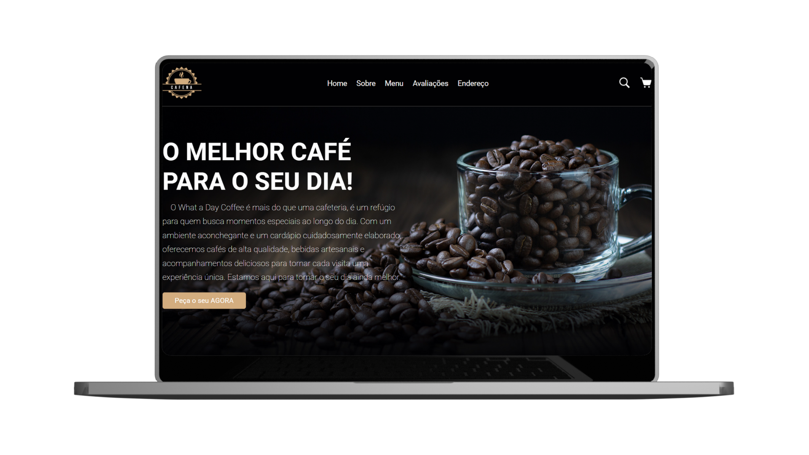
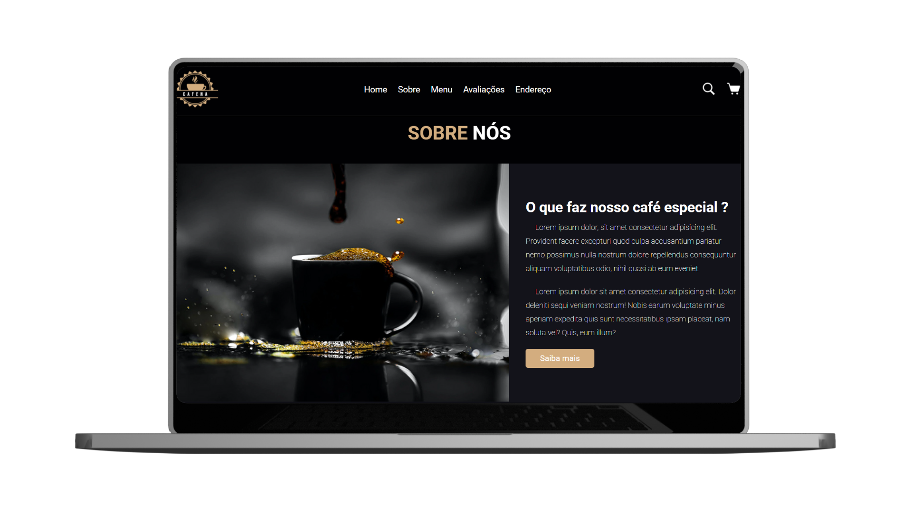
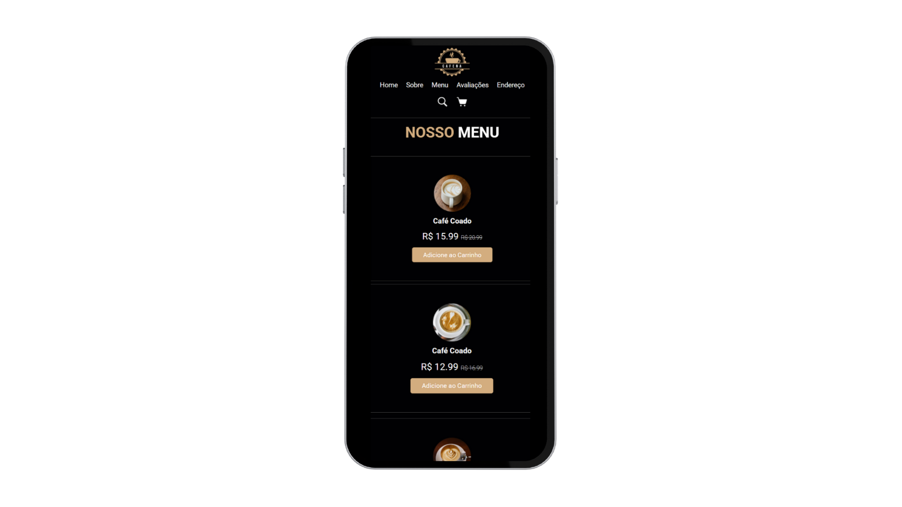
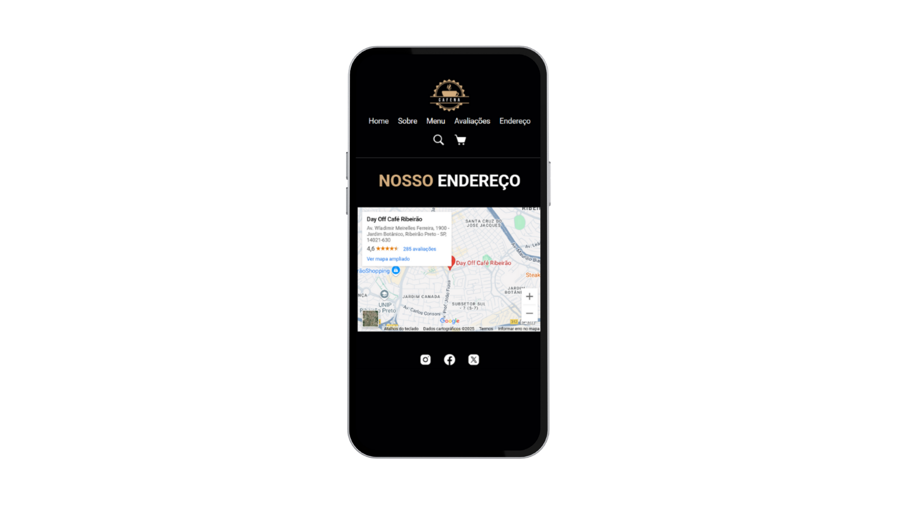

# Site de uma Cafeteria

Um site simples e bonito para uma cafeteria fictícia. Com um layout receptivo e seções para apresentar o cardápio e o ambiente da cafeteria.

## Tecnologias

- HTML5
- CSS3
- Flexbox e Grid Layout

## Seções do site

- Home de apresentação
- Sobre a cafeteria
- Menu / Cardápio
- Avaliações
- Endereço e Redes Sociais

## Preview

### Versão Desktop

  
  

 

### Versão Mobile

  
  

